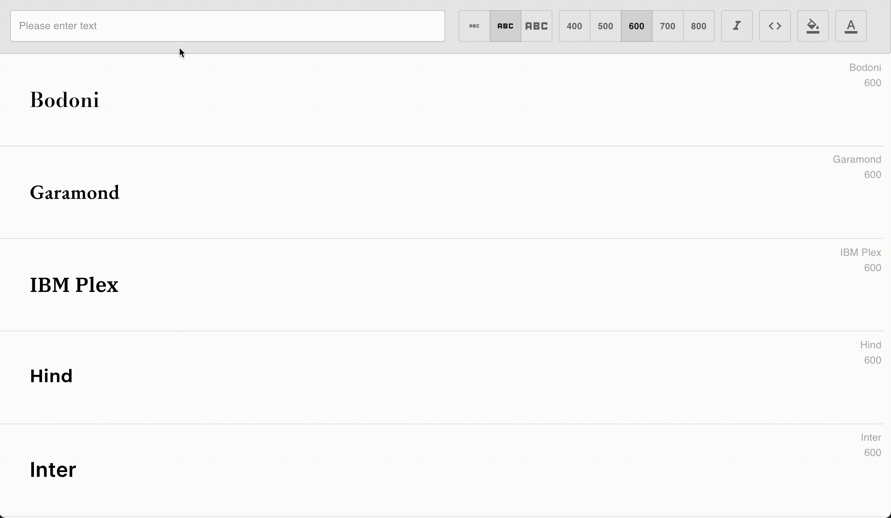
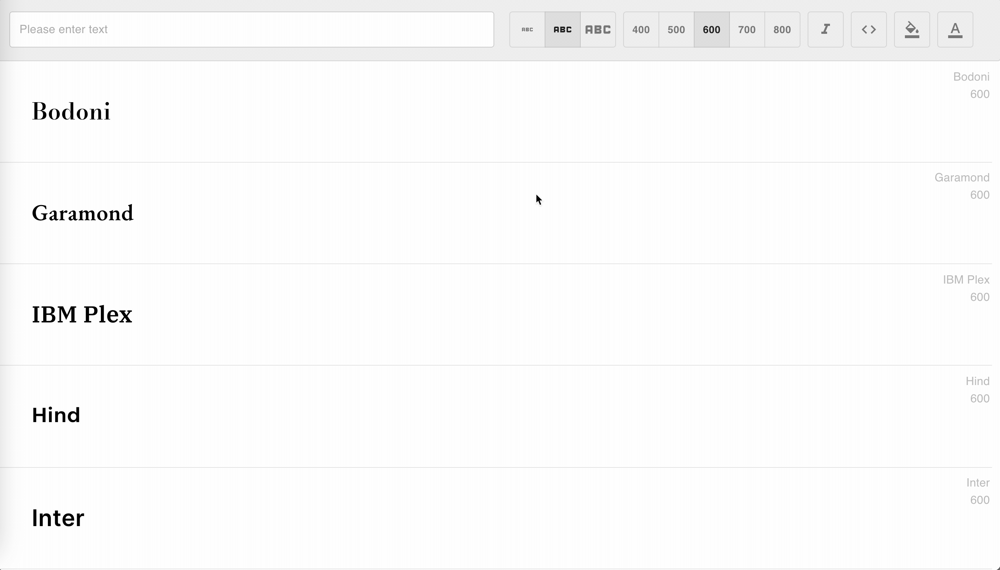
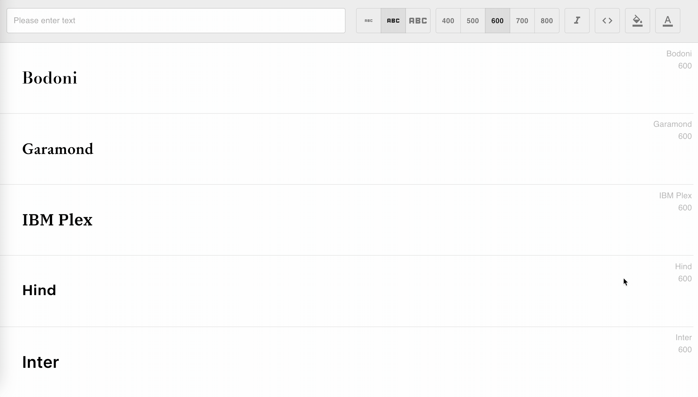

<div align="center">


# The Only Fonts You Need

## [Live Preview]()


</div>

#### Table of Contents

- [Motivation](#Motivation)
- [Features](#Features)
- [Install](#Install)
- [Stack](#Stack)

## Motivation

Over the holidays I started learning more about Fonts; Serif, Sans Serif, Display, etc... What became clear was that there were too many to choose from. Then I came across this video:

[Designers Only Need These 6 Fonts. Trash the Rest.](https://www.youtube.com/watch?v=_4cW79vF1mU)

My idea for this project was to create a preview app that only has fonts that a designer might _need_. Another important point is that the fonts are readily available (and free). Fonts like Futura are classics but cannot be found for free - I looked for free alteratives on Google Fonts.

## Features:

#### Dynamic Text Preview

<div align="center">

```
So that I can see how my font will look,
I need to be able to see a preview.
```



</div>

&nbsp;

To prevent the input field from rerendering after typing a character I used the _useEffect_ and _useRef_ hooks alongside _useState_.

#### Toggle Weight, Size and Italic

<div align="center">

```
So that I can try different styles,
I need to be able to adjust weight, size and italic.
```



</div>

&nbsp;

The first build of the project fell victim to _prop drilling_; for instance the props for the navbar...

```javascript
const navProps = {
  setBodyColor,
  bodyColor,
  setTextColor,
  textColor,
  setFontSize,
  fontSize,
  updatePreviewText,
  previewText,
  setFontWeight,
  fontWeight,
  setCodeDisplay,
  codeDisplay,
  setFontItalic,
  fontItalic,
  previewInput,
};
```

After some research on the _useContext_ hook, I wrapped the project in a _provider_ which gives global state and saves the waterfall of props.

### Custom Theme

<div align="center">

```
So that I can try different colors,
I need to be able to create a custom theme.
```


</div>

&nbsp;

The theme is also controlled with _useContext_. The preview table component takes a style prop which has variables defined by _useContext_.

```javascript
...
const { myBodyColor } = useContext(BodyColorContext);
const { myTextColor } = useContext(TextColorContext);

const colorTheme = createTheme({
    body: myBodyColor,
    text: myTextColor,
  });

  return (
    <ThemeProvider theme={colorTheme}>
...
```

#### 'Click-to-Copy' CDN and CSS

<div align="center">

```
To make my life easier,
I need to have the code snippets ready-made to copy.
```



</div>

&nbsp;

I used [react-syntax-highlighter](https://github.com/react-syntax-highlighter/react-syntax-highlighter) which has a great [demo page](https://react-syntax-highlighter.github.io/react-syntax-highlighter/demo/) to preview highlighting themes.

And a package called [react-copy-to-clipboard](https://github.com/nkbt/react-copy-to-clipboard) for the click to copy feature.

## Stack

- React
- Jest
- Enzyme
- Material UI
- Heroku
